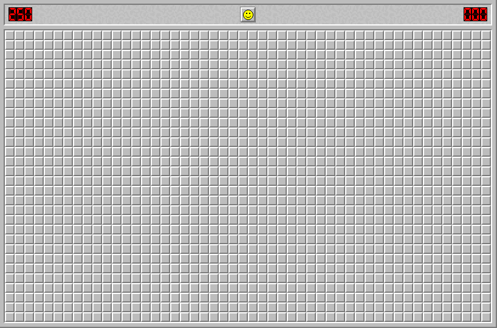

# Autosweep

Automatically play Minesweeper, written in C++. Supports https://minesweeperonline.com/. Example:

## Building

Required libraries: OpenCV and X11.

Uses meson and ninja for building:

    meson builddir
    ninja -C builddir
